<h3> Application Gestion de comptes bancaires </h3>
<h5> basée sur une architecture de microservices </h5>
<p>

Ce projet vise à développer une application de gestion de comptes bancaires basée sur une architecture de microservices. L'objectif principal est de fournir une API REST pour effectuer des opérations CRUD (Create, Read, Update, Delete) sur des objets Compte. Chaque compte est défini par un identifiant, un solde, une date de création, un type et une devise.
</p>
<p>
L'API permet aux clients d'effectuer les opérations suivantes :

    - Lire la liste de tous les comptes via une requête GET sur /api/comptes
    - Lire les détails d'un compte via une requête GET sur /api/comptes/{id}
    - Créer un nouveau compte via une requête POST sur /api/comptes
    - Mettre à jour un compte existant via une requête PUT sur /api/comptes/{id}
    - Supprimer un compte via une requête DELETE sur /api/comptes/{id}
</p>
 <h3> Prerequisites </h3>

- IDE (IntelliJ)
- Java 17
- Maven
- Postman
- SwaggerAPI

## Installation
#### Clone the repository

```git clone https://github.com/soukainatronnebati/Microservice_BankAccount.git```

#### Build the project

```mvn clean install```

#### Run the application

```mvn spring-boot:run```

The application will start on port 8081.

## Usage
### Création d'une Entité :

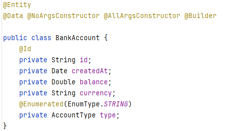

### Création de Repository:

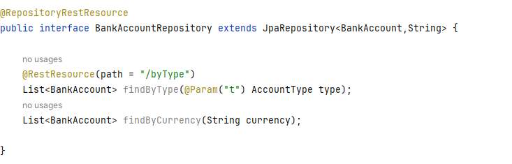

### Création de Service:


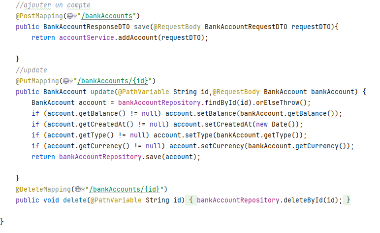
### Test avec Postman:
#### Afficher tous les comptes:


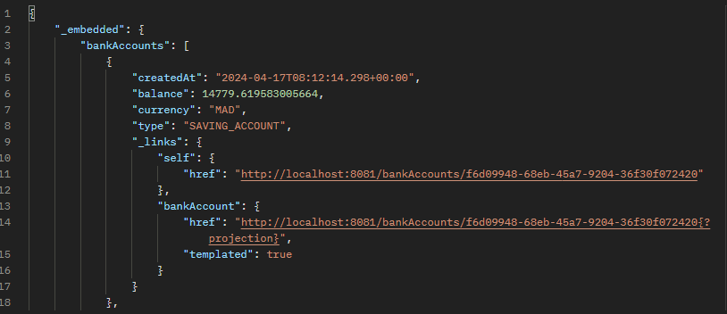

#### Afficher un comptes:


### Swagger Documentation:

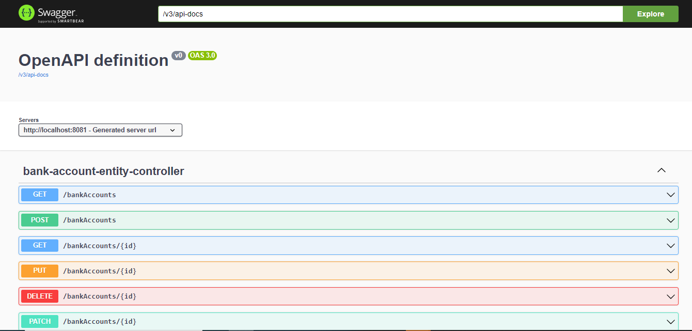

### Création des dto et Mappers:
#### RequestDTO:
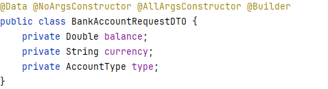

#### ResponseDTO:
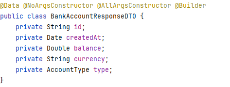

#### Mapper:
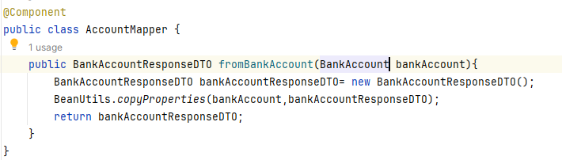

### Création de Service:
#### Interface Service:
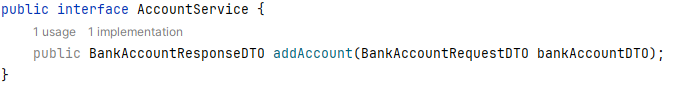

#### Service Implementation:
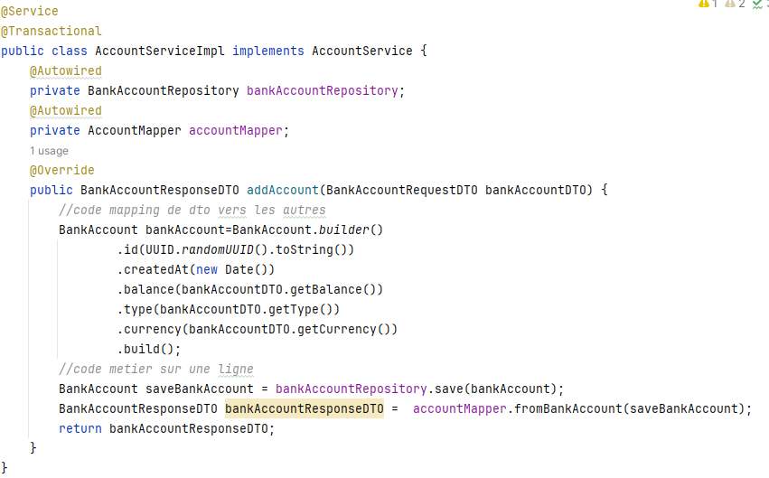

### GraphQL:
#### schema:
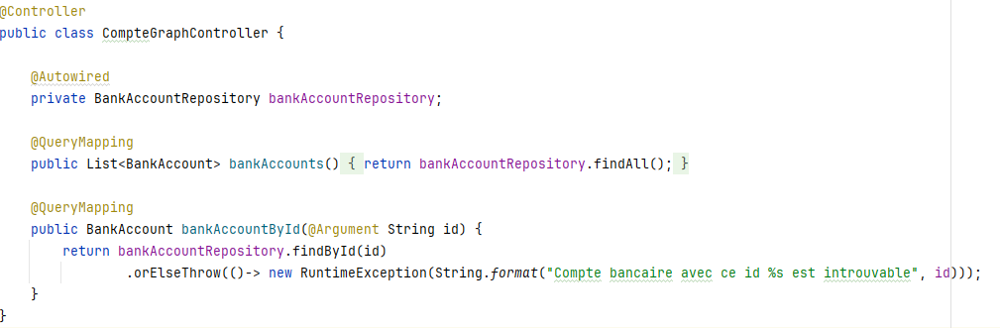

#### Test des schemas:
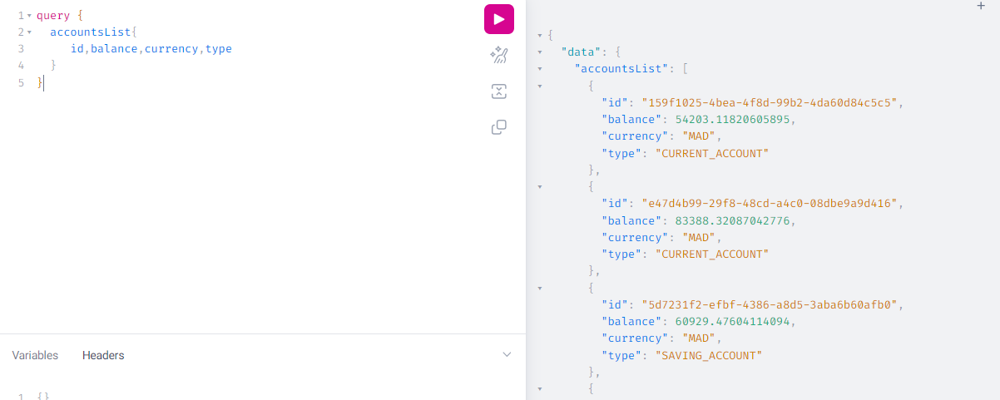

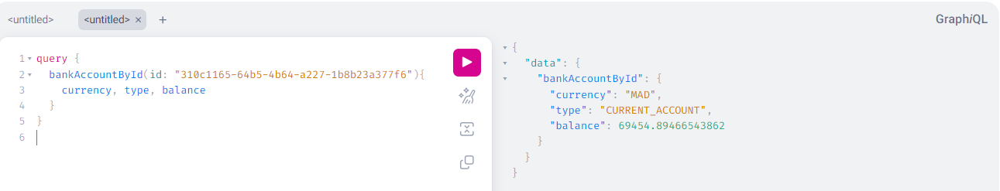
